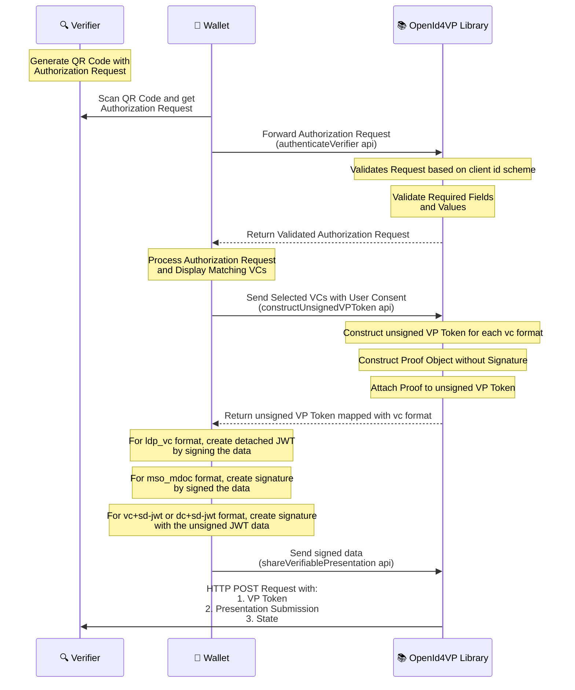

# INJI-OpenID4VP

Description: Implementation of OpenID for Verifiable Presentations - in Kotlin

## OpenID4VP specification draft versions supported

- OpenID for Verifiable Presentations - draft 21
- OpenID for Verifiable Presentations - draft 23

# Supported features

| Feature                                                    | Supported values                                                                                                                                                                                                                                                                                                                                  |
|------------------------------------------------------------|---------------------------------------------------------------------------------------------------------------------------------------------------------------------------------------------------------------------------------------------------------------------------------------------------------------------------------------------------|
| Device flow                                                | Cross device flow, Same device flow (only `direct_post` and `direct_post.jwt` supported)                                                                                                                                                                                                                                                          |
| Client id scheme                                           | `pre-registered`, `redirect_uri`, `did`                                                                                                                                                                                                                                                                                                           |
| Signed authorization request verification algorithms       | Ed25519                                                                                                                                                                                                                                                                                                                                           |
| Obtaining authorization request                            | - By value : both signed (via `request` param) and unsigned (via URL encoded parameters)<br/> - By reference ( via `request_uri` method)<br/>_Note: The use of signed or unsigned requests, is determined by the `client_id_scheme` associated with the client._ ([more details](#client-id-schemes-and-signed--unsigned-request-support-matrix)) |
| Obtaining presentation definition in authorization request | By value, By reference (via `presentation_definition_uri`)                                                                                                                                                                                                                                                                                        |
| Authorization Response content encryption algorithms       | `A256GCM`                                                                                                                                                                                                                                                                                                                                         |
| Authorization Response key encryption algorithms           | `ECDH-ES`                                                                                                                                                                                                                                                                                                                                         |
| Credential formats                                         | `ldp_vc`, `mso_mdoc`, `dc+sd-jwt`, `vc+sd-jwt`                                                                                                                                                                                                                                                                                                    |
| Authorization Response mode                                | `direct_post`, `direct_post.jwt` (with encrypted & unsigned responses) and `iar-post` (unencrypted response), `iar-post.jwt` (Encrypted and unsigned response)                                                                                                                                                                                    |
| Authorization Response type                                | `vp_token`                                                                                                                                                                                                                                                                                                                                        |

### Client ID Schemes and Signed / Unsigned request support matrix

| Client Id Scheme | Supports Unsigned request             | Supports Signed request | Notes                                                                                                                                                                                                                                                                    |
|------------------|---------------------------------------|-------------------------|--------------------------------------------------------------------------------------------------------------------------------------------------------------------------------------------------------------------------------------------------------------------------|
| `pre-registered` | depends ⚖️ on pre-registered Verifier | ✅                       | When `shouldValidateClient` is true, unsigned requests are allowed only if the pre-registered verifier's `allowUnsignedRequest` is true. Otherwise, unsigned requests are always allowed. For signed requests, the trusted verifier's `jwks_uri` is used for validation. |
| `redirect_uri`   | ✅                                     | ❌                       | Signed request is not supported, since this client ID scheme mandates unsigned Authorization Request as per the specification. [(reference)](https://openid.net/specs/openid-4-verifiable-presentations-1_0-ID3.html#section-5.10.4-2.1)                                 |
| `did`            | ❌                                     | ✅                       | Only signed Authorization Requests are allowed. Requests can be sent by value or by reference, but must always be signed.                                                                                                                                                |

**Note:** 
- All `By Reference` requests are fetched using HTTP GET / POST method and expected to be _**signed**_ JWT.
- All `By Value` requests are either _**signed**_ JWT or URL-encoded parameters (_**unsigned**_).

### Notes on Supported response modes
1. `direct_post` :
    - Authorization Response is sent as a POST request to the `response_uri` endpoint. Authorization Response is attached as request body in `application/x-www-form-urlencoded` HTTP content type
2. `direct_post.jwt` :
    - Authorization Response is sent as a POST request to the `response_uri` endpoint.
    - Authorization Response is attached as request body in `application/x-www-form-urlencoded` HTTP content type.
    - The response is encrypted using the public key provided in the client_metadata of the authorization request.
    - The created JWE's header contains the `apu` (producer info) as wallet generated nonce (with entropy 16 bytes) and `apv` (recipient info) as the verifier nonce i.e., the nonce received in the authorization request.
   > Note: If the Authorization request includes an `mso_mdoc` format VP, it can only use the `direct_post.jwt` response mode, as required by the ISO-18013-7 specification. Other supported response mode (`direct_post`) is not applicable.
3. `iar-post` :
    - Authorization Response is constructed in unencrypted format.
    - Sample Authorization response structure:
   ```shell
    {
      "vp_token": <verifiable-presentation-token>,
      "presentation_submission": { ... }
    }
    ```
4. `iar-post.jwt` :
    - Authorization Response is constructed in encrypted format (and unsigned) using the public key provided in the client_metadata of the authorization request.
    - The created JWE's header contains the apu (producer info) as wallet generated nonce (with entropy 16 bytes) and apv (recipient info) as the verifier nonce i.e., the nonce received in the authorization request.
    - Sample Authorization response structure:
   ```shell
    {
      "response": <encryoted data of vp_token & presentation_submission>
    }
    ```

## Specifications supported
- The implementation follows OpenID for Verifiable Presentations - [draft 21](https://openid.net/specs/openid-4-verifiable-presentations-1_0-21.html) and [draft 23](https://openid.net/specs/openid-4-verifiable-presentations-1_0-23.html) specifications.
- Below are the fields we expect in the authorization request based on the client id scheme,
    - Client_id_scheme is **_pre-registered_**
        * client_id
        * client_id_scheme
        * presentation_definition/presentation_definition_uri
        * response_type
        * response_mode
        * nonce
        * state
        * response_uri
        * client_metadata (Optional)

    - Client_id_scheme is **_redirect_uri_**
        * client_id
        * client_id_scheme
        * presentation_definition/presentation_definition_uri
        * response_type
        * nonce
        * state
        * redirect_uri
        * client_metadata (Optional)

    - **_Request Uri_** is also supported as part of this version.
    - When request_uri is passed as part of the authorization request, below are the fields we expect in the authorization request,
        * client_id
        * client_id_scheme
        * request_uri
        * request_uri_method

    - The request uri can return either a jwt token/encoded if it is a jwt the signature is verified as mentioned in the specification.
    - The client id and client id scheme from the authorization request and the client id and client id scheme received from the response of the request uri should be same.
- VC format supported is Ldp Vc as of now.

**Note** : 
- The pre-registered client id scheme validation can be toggled on/off based on the optional boolean which you can pass to the authenticateVerifier methods shouldValidateClient parameter. This is false by default. 

## Functionalities

- Decode and parse the Verifier's encoded Authorization Request received from the Wallet.
- Authenticates the Verifier using the received clientId and returns the valid Presentation Definition to the Wallet.
- Receives the list of verifiable credentials(VC's) from the Wallet which are selected by the Wallet end user based on the credentials requested as part of Verifier Authorization request.
- Constructs the verifiable presentation and send it to wallet for generating Json Web Signature (JWS).
- Receives the signed Verifiable presentation and sends a POST request with generated vp_token and presentation_submission to the Verifier response_uri endpoint.

**Note** : Fetching Verifiable Credentials by passing [Scope](https://openid.net/specs/openid-4-verifiable-presentations-1_0.html#name-using-scope-parameter-to-re) param in Authorization Request is not supported by this library.

## Library implementations available in:

This library is officially supported and available in both Kotlin and Swift, ensuring seamless integration across Android and iOS platforms. The references for both implementations are provided below:
* [Kotlin](./kotlin/openID4VP/README.md)
* [Swift](https://github.com/mosip/inji-openid4vp-ios-swift)

## Migration (0.7.0 -> 0.8.0)

If you are upgrading from `0.7.0` to `0.8.0`, see [Migration Guide: inji-openid4vp 0.7.0 -> 0.8.0](doc/migration-guide/MIGRATION_0.7.0_TO_0.8.0.md).

##### The below diagram shows the interactions between Wallet, Verifier and OpenID4VP library


